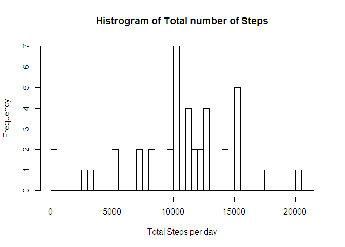
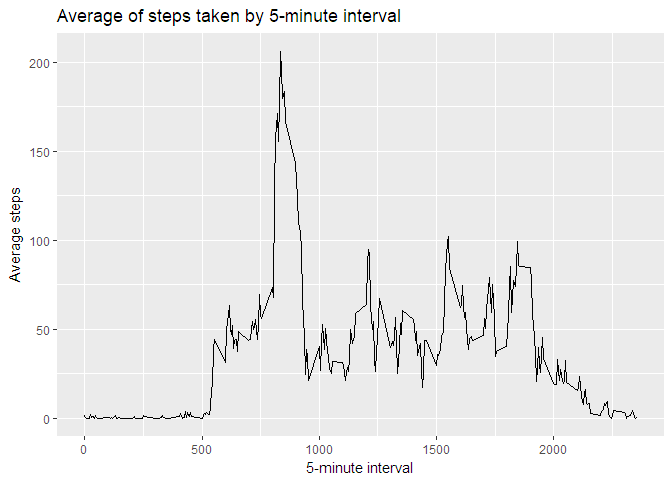
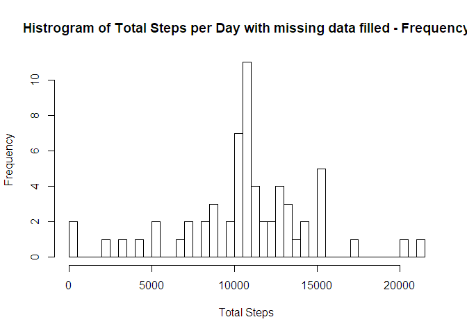
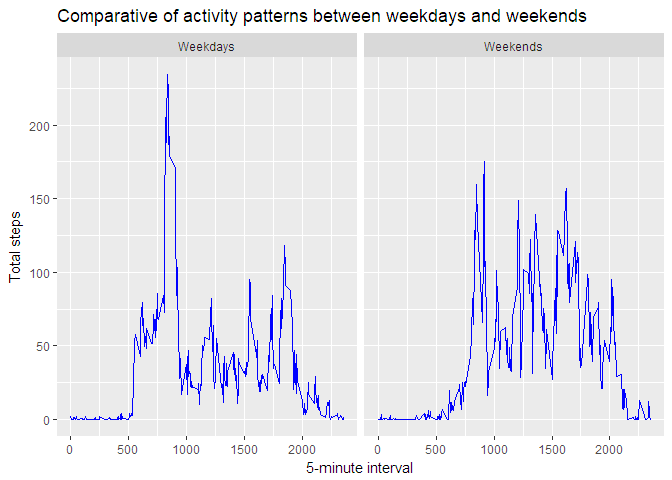

# Reproducible Research: Peer Assessment 1
Elena Bonilla  
12 de marzo de 2018  


## Loading and preprocessing the data

This is the code for loading the data

```r
##Load the data
dataFile <- "activity.csv"

#Read file
basedata <- read.csv(dataFile, sep = ",")

#Remove NAs
data <- basedata[!is.na(basedata$steps),]
```


## What is mean total number of steps taken per day?

We need to calculate total number of steps taken per day:


```r
#Load libraries
library(dplyr)
```

```
## Warning: package 'dplyr' was built under R version 3.3.3
```

```
## 
## Attaching package: 'dplyr'
```

```
## The following objects are masked from 'package:stats':
## 
##     filter, lag
```

```
## The following objects are masked from 'package:base':
## 
##     intersect, setdiff, setequal, union
```

```r
library(ggplot2)
```

```
## Warning: package 'ggplot2' was built under R version 3.3.3
```

```r
library(lubridate)
```

```
## Warning: package 'lubridate' was built under R version 3.3.3
```

```
## 
## Attaching package: 'lubridate'
```

```
## The following object is masked from 'package:base':
## 
##     date
```

```r
#Calculate Total Steps per day
dataStepsSum <- with(data, aggregate(steps, list(date), sum))
dataStepsSum <- rename(dataStepsSum, date = Group.1, steps = x)
dataStepsSum <- select(dataStepsSum, steps, date)
```

The histogram of the total number of steps taken each day is the following:


```r
#Generate graph
hist(dataStepsSum$steps, breaks = nrow(dataStepsSum), main = "Histrogram of Total number of Steps", xlab = "Total Steps per day")
```

<!-- -->


We calculate and report the mean and median of the total number of steps taken per day:


```r
#Calculate mean and median
meanSteps <- round(mean(dataStepsSum$steps),2)
medianSteps <- round(median(dataStepsSum$steps),2)
```

> Values of mean and median for data without NAs
> 
.      | values
------ | -----------------------------
mean   | 10766.19
median | 10765


## What is the average daily activity pattern?

We make a time series plot of the 5-minute interval (x-axis) and the average number of steps taken, averaged across all days (y-axis):


```r
#Calculate average number of steps per 5-minute interval
dataIntervalAverage <- with(data, aggregate(steps, list(interval), mean))
dataIntervalAverage <- rename(dataIntervalAverage, interval = Group.1, steps = x)

#Plot
with(dataIntervalAverage, qplot(x = interval, y = steps, geom = "line", main = "Average of steps taken by 5-minute interval", xlab = "5-minute interval", ylab = "Average steps"))
```

<!-- -->

We calculate 5-minute interval that contains the maximum number of steps on average across all the days:


```r
#Calculate maximum number of steps interval
maxIntervalAverage <- dataIntervalAverage[dataIntervalAverage$steps == max(dataIntervalAverage$steps),]
```

> The maximum average interval of 5-minutes interval is 835 with an average of 206.17 steps.

## Imputing missing values

We calculate and report the total number of missing values in the dataset:


```r
#Calculate total number of missing values
naRows <- nrow(basedata[is.na(basedata),])
```

> Total number of rows with missing values is 2304

We create a strategy for filling in all of the missing values in the dataset, in this case we are going to use the mean of steps for that 5-minute interval.


We create a new dataset that is equal to the original dataset but with the missing data filled in:


```r
#Create a new dataset that is equal to the original dataset but with the missing data filled in.
#The NAs values are replaced with the mean of this interval contained in dataset dataIntervalAverage

basedata %>% 
inner_join(dataIntervalAverage, by = "interval") %>%
mutate(steps = ifelse(is.na(steps.x), steps.y, steps.x)) %>%
select(steps, date, interval) -> dataTreated

#Calculate Total Steps per day
dataStepsSumTreated <- with(dataTreated, aggregate(steps, list(date), sum))
dataStepsSumTreated <- rename(dataStepsSumTreated, date = Group.1, steps = x)
dataStepsSumTreated <- select(dataStepsSumTreated, steps, date)
```

We make a histogram of the total number of steps taken each day and Calculate and report the mean and median total number of steps taken per day. 


```r
#Plot histogram
hist(dataStepsSumTreated$steps, breaks = nrow(dataStepsSumTreated), main = "Histrogram of Total Steps per Day with missing data filled - Frequency", xlab = "Total Steps")
```

<!-- -->

We calculate the mean and median:


```r
#Calculate mean and median
meanStepsTreated <- round(mean(dataStepsSumTreated$steps),2)
medianStepsTreated <- round(median(dataStepsSumTreated$steps),2)
```

> Comparative of mean and median for data with and without NAs
> 
values | data with NA                  | data without NA                      | difference
------ | ----------------------------- | ------------------------------------ | ------------------------------------------------
mean   | 10766.19   | 10766.19   | 0
median | 10765 | 10766.19 | -1.19000000000051

#### Do these values differ from the estimates from the first part of the assignment? 

Yes, it differ from the estimates.

#### What is the impact of imputing missing data on the estimates of the total daily number of steps?

The mean remains the same, but the median is bigger without missing data.


## Are there differences in activity patterns between weekdays and weekends?

We create a new factor variable in the dataset with two levels - "weekday" and "weekend" indicating whether a given date is a weekday or weekend day.


```r
getTypeOfDay <- function(x) {ifelse(x %in% c(7,1),"Weekends", "Weekdays")}

data %>%
        mutate(wdays = wday(ymd(date))) %>% 
        mutate(typeOfDay = as.factor(getTypeOfDay(wdays))) %>%
        select(steps, date, interval, typeOfDay) -> dataDays

dataDaysAverage <- with(dataDays, aggregate(steps, list(interval, typeOfDay), mean))
dataDaysAverage <- rename(dataDaysAverage, interval = Group.1, typeOfDay = Group.2, steps = x)
```

We make a panel plot containing a time series plot of the 5-minute interval (x-axis) and the average number of steps taken, averaged across all weekday days or weekend days (y-axis):


```r
g <- ggplot(dataDaysAverage, aes(interval, steps)) 
g <- g + geom_line(col="blue") + facet_wrap(~typeOfDay)
g <- g + ggtitle("Comparative of activity patterns between weekdays and weekends")
g <- g + xlab("5-minute interval") + ylab("Total steps")
g
```

<!-- -->
